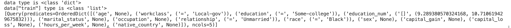

## data/census13/workload/base.pkl

train len is 100000; valid len is 10000; test len is 10000

```python
print("data type is", type(data))  # <class 'dict'> dict_keys(['train', 'valid', 'test'])
print("data[\"train\"] type is", type(data["train"]))  # <class 'list'> 100000
```



## data/census13/workload/base-original-label.pkl
train len is 100000; valid len is 10000; test len is 10000

